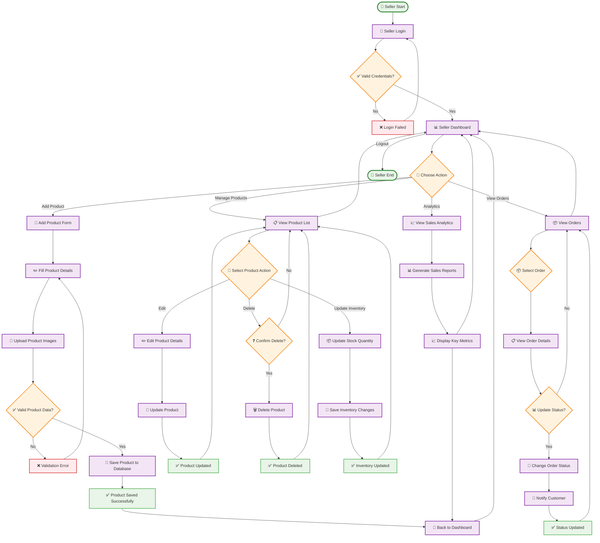
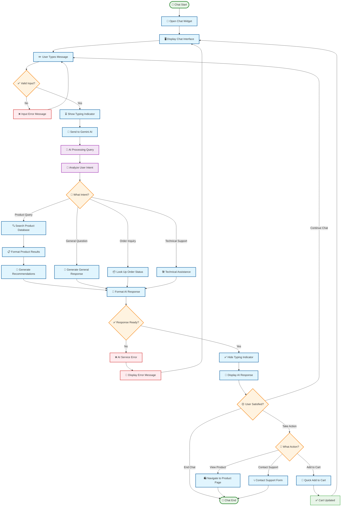
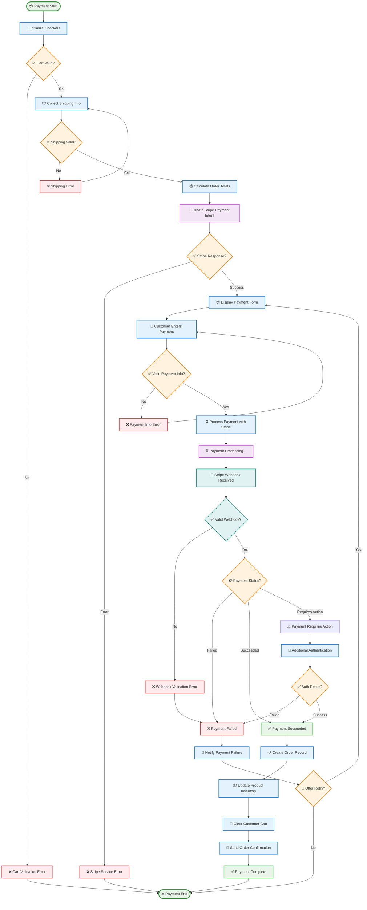

# SnapCart E-Commerce Platform - Activity Diagram

## Business Process Overview
SnapCart activity diagrams illustrate the key business processes and user workflows including customer shopping journey, seller product management, payment processing, and AI chat interactions.

## Main Activity Diagrams

### 1. Customer Shopping Journey

```mermaid
flowchart TD
    Start([🚀 Start]) --> BrowseHome[🏠 Browse Homepage]
    BrowseHome --> ViewProducts{🛍️ View Products?}
    
    ViewProducts -->|Yes| ProductShowcase[📱 Product Showcase]
    ViewProducts -->|No| SearchProducts[🔍 Search Products]
    
    SearchProducts --> ProductResults[📋 Search Results]
    ProductResults --> ProductShowcase
    
    ProductShowcase --> FilterProducts{🎯 Filter Products?}
    FilterProducts -->|Yes| ApplyFilters[⚙️ Apply Price/Category Filters]
    FilterProducts -->|No| ViewProductDetail[👁️ View Product Details]
    
    ApplyFilters --> FilteredResults[📊 Filtered Results]
    FilteredResults --> ViewProductDetail
    
    ViewProductDetail --> AuthCheck{🔐 User Authenticated?}
    AuthCheck -->|No| LoginPrompt[🔑 Login Prompt]
    LoginPrompt --> Login[📝 User Login]
    Login --> AuthSuccess{✅ Login Success?}
    AuthSuccess -->|No| LoginError[❌ Login Error]
    LoginError --> Login
    AuthSuccess -->|Yes| AddToCart
    
    AuthCheck -->|Yes| AddToCart[🛒 Add to Cart]
    AddToCart --> CartUpdated[✅ Cart Updated]
    CartUpdated --> ContinueShopping{🛍️ Continue Shopping?}
    
    ContinueShopping -->|Yes| ProductShowcase
    ContinueShopping -->|No| ViewCart[🛒 View Cart]
    
    ViewCart --> CartEmpty{📋 Cart Empty?}
    CartEmpty -->|Yes| EmptyCartMessage[📭 Empty Cart Message]
    EmptyCartMessage --> ProductShowcase
    
    CartEmpty -->|No| ModifyCart{✏️ Modify Cart?}
    ModifyCart -->|Update Quantity| UpdateQuantity[🔢 Update Item Quantity]
    ModifyCart -->|Remove Item| RemoveItem[🗑️ Remove Item]
    ModifyCart -->|Proceed| Checkout[💳 Proceed to Checkout]
    
    UpdateQuantity --> RecalculateTotal[💰 Recalculate Total]
    RemoveItem --> RecalculateTotal
    RecalculateTotal --> ViewCart
    
    Checkout --> EnterShipping[📦 Enter Shipping Details]
    EnterShipping --> ValidateShipping{✅ Valid Shipping Info?}
    ValidateShipping -->|No| ShippingError[❌ Shipping Error]
    ShippingError --> EnterShipping
    
    ValidateShipping -->|Yes| PaymentMethod[💳 Select Payment Method]
    PaymentMethod --> StripePayment[💰 Stripe Payment Form]
    StripePayment --> ProcessPayment[⚙️ Process Payment]
    
    ProcessPayment --> PaymentResult{💳 Payment Success?}
    PaymentResult -->|No| PaymentError[❌ Payment Failed]
    PaymentError --> PaymentMethod
    
    PaymentResult -->|Yes| CreateOrder[📋 Create Order]
    CreateOrder --> ClearCart[🧹 Clear Cart]
    ClearCart --> OrderConfirmation[✅ Order Confirmation]
    OrderConfirmation --> SendEmail[📧 Send Confirmation Email]
    SendEmail --> End([🏁 End])
    
    %% Styling
    classDef startEnd fill:#e8f5e8,stroke:#388e3c,stroke-width:3px
    classDef process fill:#e3f2fd,stroke:#1976d2,stroke-width:2px
    classDef decision fill:#fff3e0,stroke:#f57c00,stroke-width:2px
    classDef error fill:#ffebee,stroke:#d32f2f,stroke-width:2px
    classDef success fill:#e8f5e8,stroke:#4caf50,stroke-width:2px
    
    class Start,End startEnd
    class BrowseHome,ProductShowcase,SearchProducts,ProductResults,ApplyFilters,FilteredResults,ViewProductDetail,Login,AddToCart,ViewCart,UpdateQuantity,RemoveItem,Checkout,EnterShipping,PaymentMethod,StripePayment,ProcessPayment,CreateOrder,ClearCart,SendEmail process
    class ViewProducts,FilterProducts,AuthCheck,AuthSuccess,ContinueShopping,CartEmpty,ModifyCart,ValidateShipping,PaymentResult decision
    class LoginError,ShippingError,PaymentError,EmptyCartMessage error
    class CartUpdated,RecalculateTotal,OrderConfirmation success
```



### 2. Seller Product Management Workflow



### 3. AI Chat Assistant Workflow



### 4. Payment Processing Workflow



## Activity Diagram Specifications

### Key Process Flows

#### 1. Customer Shopping Journey
- **Duration**: 5-30 minutes average
- **Entry Points**: Homepage, search, direct product links
- **Key Decision Points**: Authentication, cart modifications, payment method
- **Success Metrics**: Completed orders, cart conversion rate
- **Error Handling**: Login failures, payment errors, validation issues

#### 2. Seller Product Management
- **Duration**: 2-15 minutes per task
- **Entry Points**: Seller dashboard login
- **Key Decision Points**: Product actions, inventory updates, order status changes  
- **Success Metrics**: Products added, orders processed, inventory accuracy
- **Error Handling**: Validation errors, image upload failures, database errors

#### 3. AI Chat Assistant
- **Duration**: 30 seconds - 5 minutes per conversation
- **Entry Points**: Chat widget activation
- **Key Decision Points**: Intent recognition, response type, user satisfaction
- **Success Metrics**: Query resolution rate, user engagement time
- **Error Handling**: AI service failures, input validation, timeout handling

#### 4. Payment Processing
- **Duration**: 1-3 minutes typical
- **Entry Points**: Checkout initiation
- **Key Decision Points**: Payment validation, Stripe responses, webhook verification
- **Success Metrics**: Payment success rate, order completion time
- **Error Handling**: Payment failures, webhook validation, retry mechanisms

### Integration Points

#### Frontend-Backend Communication
```
User Action → Component → Service → HTTP Request → Backend Controller → Service → Repository → Database
```

#### External Service Integration
```
Backend Service → External API → Webhook/Response → Database Update → Frontend Notification
```

#### Real-time Updates
```
Database Change → Service Event → WebSocket/Polling → Frontend Update → User Interface Refresh
```

### Performance Considerations

#### Response Time Targets
- **Product Loading**: < 2 seconds
- **Cart Operations**: < 1 second  
- **Payment Processing**: < 5 seconds
- **AI Chat Response**: < 3 seconds

#### Scalability Factors
- **Concurrent Users**: 100+ simultaneous sessions
- **Product Catalog**: 10,000+ products
- **Order Volume**: 1,000+ orders per day
- **Chat Sessions**: 50+ concurrent conversations

### Error Recovery Patterns

#### Graceful Degradation
- **Payment Failures**: Multiple retry attempts with different methods
- **AI Service Outage**: Fallback to predefined responses
- **Database Connectivity**: Cached data presentation
- **Image Loading**: Placeholder images with retry mechanisms

#### User Experience Continuity
- **Session Management**: Persistent cart across browser sessions
- **Form Data**: Auto-save of checkout information
- **Search State**: Maintained filter preferences
- **Navigation**: Breadcrumb trail preservation

This activity diagram documentation provides comprehensive workflows for all major business processes in the SnapCart e-commerce platform, ensuring clear understanding of user journeys, system interactions, and error handling procedures.