# SnapCart E-Commerce Platform - Component Diagram

## System Architecture Overview
SnapCart is a full-stack e-commerce platform built with Angular frontend, Spring Boot backend, MongoDB database, and integrated with external services like Stripe and JetFormAi AI.

## Component Diagram

```mermaid
graph TB
    %% External Users
    Customer[👤 Customer Browser]
    Seller[👨‍💼 Seller Browser] 
    Admin[👨‍💻 Admin Browser]
    F
    %% Frontend Layer - Angular Application
    subgraph "Frontend Layer (Angular 18+)"
        subgraph "Core Components"
            AppComponent[App Component<br/>🏠 Main App Shell]
            NavBarComponent[Navigation Bar<br/>🧭 Header & Menu]
            HomeComponent[Home Component<br/>🏡 Landing Page]
            ProductShowcaseComponent[Product Showcase<br/>🛍️ Product Grid]
        end
        
        subgraph "Feature Components"
            CartComponent[Cart Component<br/>🛒 Shopping Cart]
            CheckoutComponent[Checkout Component<br/>💳 Payment Form]
            ChatWidgetComponent[Chat Widget<br/>🤖 AI Assistant]
            SignComponent[Sign Component<br/>🔐 Auth Forms]
            SellerComponent[Seller Component<br/>👨‍💼 Seller Dashboard]
        end
        
        subgraph "Shared Components"
            CarouselComponent[Carousel Component<br/>🎠 Image Slider]
            AdCardComponent[Ad Card Component<br/>📢 Promotional Cards]
            DashboardComponent[Dashboard Component<br/>📊 Analytics View]
        end
        
        subgraph "Services Layer"
            CartService[Cart Service<br/>🛒 Cart State Management]
            CheckoutService[Checkout Service<br/>💰 Payment Processing]
            ChatService[Chat Service<br/>💬 AI Communication]
            CookieService[Cookie Service<br/>🍪 Session Management]
            ProductEditService[Product Edit Service<br/>✏️ Product CRUD]
        end
        
        subgraph "Routing & Configuration"
            AppRoutes[App Routes<br/>🛤️ Navigation Config]
            AppConfig[App Config<br/>⚙️ Application Settings]
        end
    end
    
    %% Backend Layer - Spring Boot Application
    subgraph "Backend Layer (Spring Boot 3.5.6)"
        subgraph "Controller Layer"
            MainController[Main Controller<br/>🎮 REST API Endpoints]
            CheckoutController[Checkout Controller<br/>💳 Order Processing]
        end
        
        subgraph "Service Layer"
            ProductService[Product Service<br/>📦 Product Business Logic]
            CartServiceBackend[Cart Service<br/>🛒 Cart Operations]
            OrderService[Order Service<br/>📋 Order Management]
            UserService[User Service<br/>👥 User Management]
            StripePaymentService[Stripe Payment Service<br/>💰 Payment Processing]
            ChatServiceBackend[Chat Service<br/>🤖 AI Integration]
        end
        
        subgraph "Repository Layer"
            ProductRepository[Product Repository<br/>📦 Product Data Access]
            UserRepository[User Repository<br/>👥 User Data Access]
            CartRepository[Cart Repository<br/>🛒 Cart Data Access]
            OrderRepository[Order Repository<br/>📋 Order Data Access]
        end
        
        subgraph "Entity Layer"
            ProductEntity[Product Entity<br/>📦 Product Model]
            UserEntity[User Entity<br/>👤 User Model]
            CartEntity[Cart Entity<br/>🛒 Cart Model]
            OrderEntity[Order Entity<br/>📋 Order Model]
        end
        
        subgraph "Configuration & Utils"
            GlobalExceptionHandler[Global Exception Handler<br/>⚠️ Error Management]
            CorsConfig[CORS Configuration<br/>🌐 Cross-Origin Setup]
            SecurityConfig[Security Configuration<br/>🔒 Authentication Setup]
        end
    end
    
    %% Database Layer
    subgraph "Database Layer (MongoDB)"
        ProductCollection[(Products Collection<br/>📦 Product Documents)]
        UserCollection[(Users Collection<br/>👥 User Documents)]
        CartCollection[(Cart Collection<br/>🛒 Cart Documents)]
        OrderCollection[(Orders Collection<br/>📋 Order Documents)]
    end
    
    %% External Services
    subgraph "External Services"
        StripeAPI[Stripe API<br/>💳 Payment Gateway]
       JetformAi[JetFormAi AI API<br/>🤖 Natural Language Processing]
        EmailService[Email Service<br/>📧 Notifications]
    end
    
    %% Client-Server Communication
    Customer --> AppComponent
    Seller --> AppComponent
    Admin --> AppComponent
    
    %% Frontend Component Relationships
    AppComponent --> NavBarComponent
    AppComponent --> HomeComponent
    AppComponent --> AppRoutes
    
    HomeComponent --> ProductShowcaseComponent
    HomeComponent --> CarouselComponent
    HomeComponent --> AdCardComponent
    HomeComponent --> ChatWidgetComponent
    
    NavBarComponent --> CartService
    ProductShowcaseComponent --> CartService
    CartComponent --> CartService
    CheckoutComponent --> CheckoutService
    ChatWidgetComponent --> ChatService
    
    %% Service to Backend Communication
    CartService -.->|HTTP/REST| MainController
    CheckoutService -.->|HTTP/REST| CheckoutController
    ChatService -.->|HTTP/REST| MainController
    ProductEditService -.->|HTTP/REST| MainController
    
    %% Backend Internal Flow
    MainController --> ProductService
    MainController --> CartServiceBackend
    MainController --> UserService
    MainController --> ChatServiceBackend
    
    CheckoutController --> OrderService
    CheckoutController --> StripePaymentService
    
    ProductService --> ProductRepository
    CartServiceBackend --> CartRepository
    UserService --> UserRepository
    OrderService --> OrderRepository
    
    ProductRepository --> ProductEntity
    CartRepository --> CartEntity
    UserRepository --> UserEntity
    OrderRepository --> OrderEntity
    
    %% Database Connections
    ProductRepository -.->|MongoDB Driver| ProductCollection
    UserRepository -.->|MongoDB Driver| UserCollection
    CartRepository -.->|MongoDB Driver| CartCollection
    OrderRepository -.->|MongoDB Driver| OrderCollection
    
    %% External Service Integrations
    StripePaymentService -.->|REST API| StripeAPI
    ChatServiceBackend -.->|REST API| JetFormAi 
    OrderService -.->|SMTP| EmailService
    
    %% Styling
    classDef frontend fill:#e3f2fd,stroke:#1976d2,stroke-width:2px
    classDef backend fill:#f3e5f5,stroke:#7b1fa2,stroke-width:2px
    classDef database fill:#e8f5e8,stroke:#388e3c,stroke-width:2px
    classDef external fill:#fff3e0,stroke:#f57c00,stroke-width:2px
    classDef user fill:#fce4ec,stroke:#c2185b,stroke-width:2px
    
    class AppComponent,NavBarComponent,HomeComponent,ProductShowcaseComponent,CartComponent,CheckoutComponent,ChatWidgetComponent,SignComponent,SellerComponent,CarouselComponent,AdCardComponent,DashboardComponent,CartService,CheckoutService,ChatService,CookieService,ProductEditService,AppRoutes,AppConfig frontend
    
    class MainController,CheckoutController,ProductService,CartServiceBackend,OrderService,UserService,StripePaymentService,ChatServiceBackend,ProductRepository,UserRepository,CartRepository,OrderRepository,ProductEntity,UserEntity,CartEntity,OrderEntity,GlobalExceptionHandler,CorsConfig,SecurityConfig backend
    
    class ProductCollection,UserCollection,CartCollection,OrderCollection database
    
    class StripeAPI,JetFormAi,EmailService external
    
    class Customer,Seller,Admin user
```



## Detailed Component Specifications

### Frontend Layer (Angular 18+)

#### Core Components
| Component | Purpose | Dependencies | Key Features |
|-----------|---------|-------------|--------------|
| **App Component** | Main application shell and routing | Angular Router, Common Module | Root component, navigation setup |
| **Navigation Bar** | Header navigation and cart indicator | Cart Service | User menu, cart count badge |
| **Home Component** | Landing page with featured content | Product Showcase, Carousel | Product discovery, promotional content |
| **Product Showcase** | Product grid display and interaction | Cart Service, HTTP Client | Product cards, add to cart, filtering |

#### Feature Components
| Component | Purpose | Dependencies | Key Features |
|-----------|---------|-------------|--------------|
| **Cart Component** | Shopping cart management | Cart Service | Item management, quantity updates, totals |
| **Checkout Component** | Payment and order completion | Checkout Service, Stripe Elements | Form validation, payment processing |
| **Chat Widget** | AI-powered customer assistance | Chat Service | Natural language queries, product recommendations |
| **Sign Component** | User authentication forms | HTTP Client, Cookie Service | Login/register, session management |
| **Seller Component** | Seller dashboard and tools | Product Edit Service | Product management, sales analytics |

#### Services Layer
| Service | Purpose | API Endpoints | Key Methods |
|---------|---------|---------------|-------------|
| **Cart Service** | Cart state management | `/api/cart/*` | addToCart(), updateQuantity(), clearCart() |
| **Checkout Service** | Order and payment processing | `/api/orders/*`, `/api/payments/*` | createOrder(), processPayment() |
| **Chat Service** | AI chat functionality | `/api/chat/*` | sendMessage(), getResponse() |
| **Cookie Service** | Session and auth management | N/A | setCookie(), getCookie(), deleteCookie() |
| **Product Edit Service** | Product CRUD operations | `/api/products/*` | createProduct(), updateProduct() |

### Backend Layer (Spring Boot 3.5.6)

#### Controller Layer
| Controller | Endpoints | Purpose | HTTP Methods |
|------------|-----------|---------|--------------|
| **Main Controller** | `/api/*` | Primary REST API endpoints | GET, POST, PUT, DELETE |
| **Checkout Controller** | `/api/orders/*`, `/api/payments/*` | Order and payment processing | POST, GET |

#### Service Layer
| Service | Purpose | Dependencies | Key Operations |
|---------|---------|-------------|----------------|
| **Product Service** | Product business logic | Product Repository | CRUD operations, search, filtering |
| **Cart Service** | Cart operations | Cart Repository, Product Service | Add/remove items, calculate totals |
| **Order Service** | Order management | Order Repository, Email Service | Create orders, status updates |
| **User Service** | User management | User Repository | Authentication, profile management |
| **Stripe Payment Service** | Payment processing | Stripe API | Payment intents, webhooks, refunds |
| **Chat Service** | AI integration | JetFormAi API | Natural language processing |

#### Repository Layer
| Repository | Entity | Database Collection | Operations |
|------------|--------|-------------------|------------|
| **Product Repository** | Product Entity | products | findAll(), findByCategory(), save() |
| **User Repository** | User Entity | users | findByEmail(), save(), delete() |
| **Cart Repository** | Cart Entity | carts | findByUserId(), save(), delete() |
| **Order Repository** | Order Entity | orders | findByUserId(), save(), updateStatus() |

#### Entity Layer
| Entity | Purpose | Key Fields | Relationships |
|--------|---------|------------|---------------|
| **Product Entity** | Product data model | id, name, price, images, description | None |
| **User Entity** | User data model | id, email, password, role | One-to-One with Cart |
| **Cart Entity** | Shopping cart model | id, userId, items, total | Many-to-One with User |
| **Order Entity** | Order data model | id, userId, items, status, payment | Many-to-One with User |

### Database Layer (MongoDB)

#### Collections Structure
| Collection | Document Structure | Indexes | Purpose |
|------------|-------------------|---------|---------|
| **products** | {id, name, price, images, category, description} | name, category, price | Product catalog storage |
| **users** | {id, email, password, role, profile} | email, role | User account storage |
| **carts** | {id, userId, items[], total, updatedAt} | userId | Shopping cart persistence |
| **orders** | {id, userId, items[], status, payment, shipping} | userId, status | Order history storage |

### External Services Integration

#### Payment Processing (Stripe)
| Integration Point | Purpose | Methods | Webhooks |
|------------------|---------|---------|----------|
| **Payment Intents** | Secure payment processing | create, confirm, cancel | payment_intent.succeeded |
| **Webhooks** | Payment status updates | handleWebhook() | payment_intent.payment_failed |
| **Refunds** | Return processing | createRefund() | charge.dispute.created |

#### AI Service (JetFormAi API)
| Integration Point | Purpose | Methods | Response Format |
|------------------|---------|---------|-----------------|
| **Natural Language Processing** | Chat query understanding | generateContent() | Structured JSON response |
| **Product Recommendations** | Intelligent suggestions | analyzeQuery() | Product relevance scores |

## Component Communication Patterns

### Frontend Communication
```
User Interaction → Component → Service → HTTP Client → Backend API
```

### Backend Processing
```
REST Controller → Service Layer → Repository → Database
```

### External Service Flow
```
Backend Service → External API → Webhook/Response → Update Database
```

## Security Architecture

### Authentication Flow
```
User Login → Backend Validation → Cookie Creation → Session Management
```

### API Security
- **CORS Configuration**: Cross-origin request handling
- **Cookie-based Authentication**: Session management
- **Input Validation**: Request data validation
- **Error Handling**: Centralized exception management

## Deployment Architecture

### Development Environment
- **Frontend**: `ng serve` (localhost:4200)
- **Backend**: Spring Boot embedded Tomcat (localhost:8080)
- **Database**: Local MongoDB instance (localhost:27017)

### Production Considerations
- **Frontend**: Static files served via CDN
- **Backend**: Containerized Spring Boot application
- **Database**: MongoDB Atlas or dedicated MongoDB cluster
- **External Services**: Production API keys and webhook endpoints

This component diagram provides a comprehensive view of the SnapCart system architecture, showing how all components interact to deliver a complete e-commerce experience.