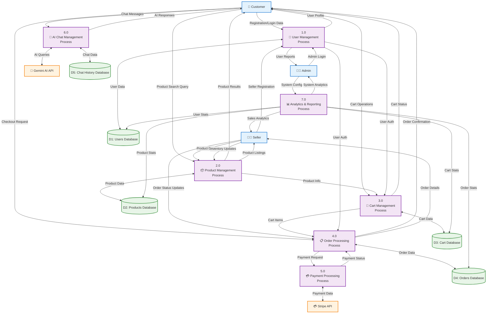
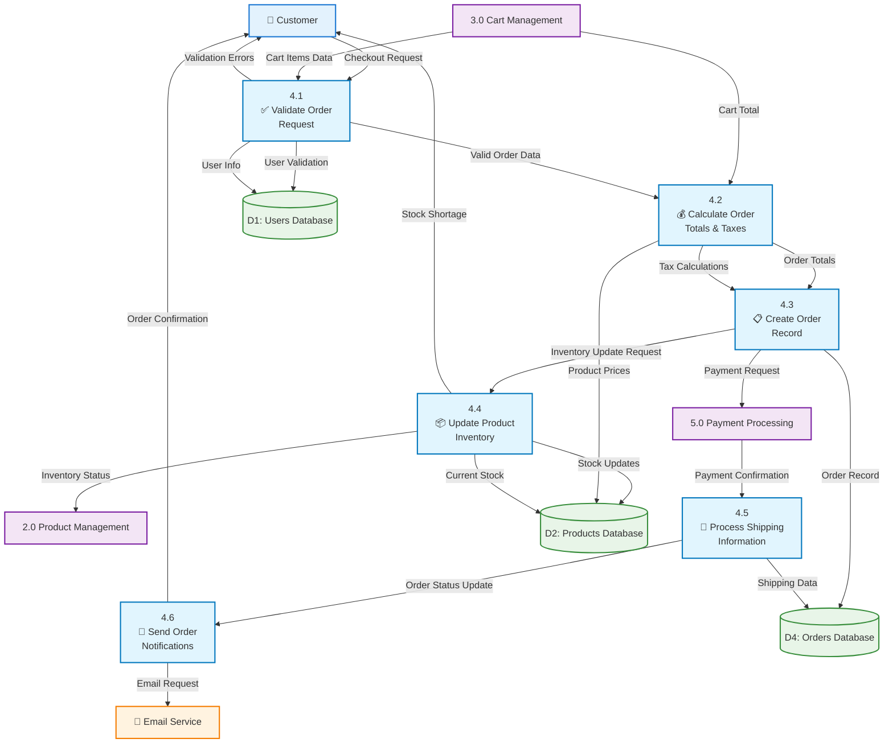
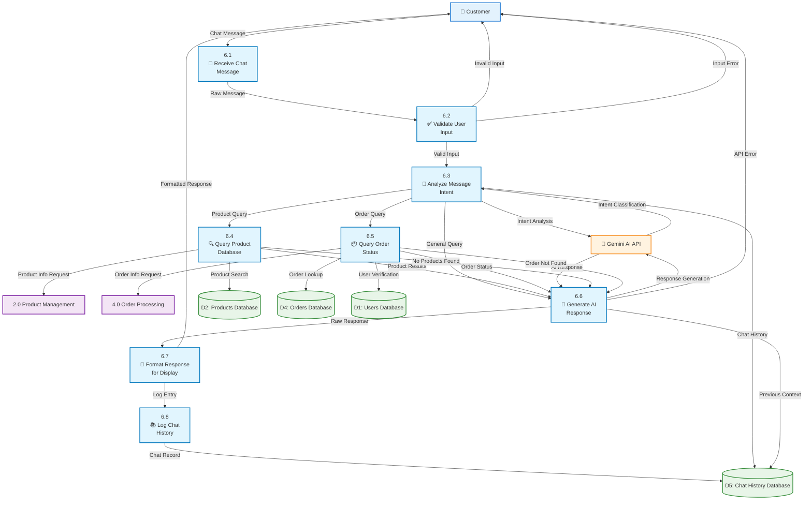

# SnapCart E-Commerce Platform - Data Flow Diagram

## System Data Flow Overview
SnapCart data flow diagrams illustrate how information moves through the system across different architectural levels, from high-level context to detailed process flows, including external integrations with Stripe payments and Gemini AI.

## Data Flow Diagrams

### Level 0 - Context Diagram (System Overview)

```mermaid
flowchart TB
    %% External Entities
    Customer[👤 Customer]
    Seller[👨‍💼 Seller]
    Admin[👨‍💻 Admin]
    StripeGateway[💳 Stripe Payment Gateway]
    GeminiAI[🤖 Gemini AI Service]
    EmailSystem[📧 Email Service]
    
    %% Main System
    SnapCartSystem[🛒 SnapCart E-Commerce System]
    
    %% Data Flows from External Entities to System
    Customer -->|User Registration Data| SnapCartSystem
    Customer -->|Product Search Queries| SnapCartSystem
    Customer -->|Cart Operations Data| SnapCartSystem
    Customer -->|Order & Payment Data| SnapCartSystem
    Customer -->|Chat Messages| SnapCartSystem
    
    Seller -->|Seller Registration Data| SnapCartSystem
    Seller -->|Product Information| SnapCartSystem
    Seller -->|Inventory Updates| SnapCartSystem
    Seller -->|Order Status Updates| SnapCartSystem
    
    Admin -->|Admin Credentials| SnapCartSystem
    Admin -->|System Configuration| SnapCartSystem
    Admin -->|User Management Data| SnapCartSystem
    
    %% Data Flows from System to External Entities
    SnapCartSystem -->|Product Catalog| Customer
    SnapCartSystem -->|Order Confirmations| Customer
    SnapCartSystem -->|Cart Status| Customer
    SnapCartSystem -->|Chat Responses| Customer
    
    SnapCartSystem -->|Sales Analytics| Seller
    SnapCartSystem -->|Order Notifications| Seller
    SnapCartSystem -->|Dashboard Data| Seller
    
    SnapCartSystem -->|System Reports| Admin
    SnapCartSystem -->|User Analytics| Admin
    
    %% External Service Integrations
    SnapCartSystem <-->|Payment Requests/Responses| StripeGateway
    SnapCartSystem <-->|AI Queries/Responses| GeminiAI
    SnapCartSystem -->|Email Notifications| EmailSystem
    
    %% Styling
    classDef entity fill:#e3f2fd,stroke:#1976d2,stroke-width:2px
    classDef system fill:#e8f5e8,stroke:#388e3c,stroke-width:3px
    classDef external fill:#fff3e0,stroke:#f57c00,stroke-width:2px
    
    class Customer,Seller,Admin entity
    class SnapCartSystem system
    class StripeGateway,GeminiAI,EmailSystem external
```

### Level 1 - System Decomposition (Major Processes)

### Level 2 - Detailed Process: Order Processing (4.0)

### Level 2 - Detailed Process: Cart Management (3.0)

```mermaid
flowchart TB
    %% External Entities & Higher Level Processes
    Customer[👤 Customer]
    ProductMgmt[2.0 Product Management]
    UserMgmt[1.0 User Management]
    OrderMgmt[4.0 Order Processing]
    
    %% Detailed Processes
    AddToCart[3.1<br/>➕ Add Item<br/>to Cart]
    UpdateQuantity[3.2<br/>🔢 Update Item<br/>Quantity]
    RemoveItem[3.3<br/>🗑️ Remove Item<br/>from Cart]
    CalculateTotal[3.4<br/>💰 Calculate Cart<br/>Total]
    ValidateCart[3.5<br/>✅ Validate Cart<br/>Contents]
    ClearCart[3.6<br/>🧹 Clear Cart<br/>After Order]
    
    %% Data Stores
    CartDB[(D3: Cart Database)]
    ProductDB[(D2: Products Database)]
    UserDB[(D1: Users Database)]
    
    %% Input Data Flows
    Customer -->|Add Product Request| AddToCart
    Customer -->|Quantity Change| UpdateQuantity
    Customer -->|Remove Item Request| RemoveItem
    Customer -->|View Cart Request| ValidateCart
    OrderMgmt -->|Clear Cart Request| ClearCart
    
    %% Authentication & Product Validation
    AddToCart -->|User Authentication| UserMgmt
    AddToCart -->|Product Availability| ProductMgmt
    UpdateQuantity -->|Stock Check| ProductDB
    
    %% Cart Operations
    AddToCart -->|New Cart Item| CartDB
    AddToCart -->|Trigger Total Calc| CalculateTotal
    
    UpdateQuantity -->|Updated Quantity| CartDB
    UpdateQuantity -->|Trigger Total Calc| CalculateTotal
    
    RemoveItem -->|Remove Item| CartDB
    RemoveItem -->|Trigger Total Calc| CalculateTotal
    
    CalculateTotal -->|Cart Total| CartDB
    CalculateTotal -->|Updated Total| Customer
    
    ValidateCart -->|Cart Contents| CartDB
    ValidateCart -->|Product Validation| ProductDB
    ValidateCart -->|Cart Data| Customer
    
    ClearCart -->|Clear Cart Data| CartDB
    
    %% Inter-process Communication
    CalculateTotal -->|Product Prices| ProductDB
    ValidateCart -->|Availability Check| ProductMgmt
    
    %% Output Data Flows
    ValidateCart -->|Cart Summary| Customer
    AddToCart -->|Cart Status| Customer
    UpdateQuantity -->|Updated Cart| Customer
    RemoveItem -->|Updated Cart| Customer
    
    %% Error Handling
    AddToCart -->|Stock Unavailable| Customer
    UpdateQuantity -->|Invalid Quantity| Customer
    ValidateCart -->|Validation Errors| Customer
    
    %% Styling
    classDef entity fill:#e3f2fd,stroke:#1976d2,stroke-width:2px
    classDef process fill:#f3e5f5,stroke:#7b1fa2,stroke-width:2px
    classDef subprocess fill:#e1f5fe,stroke:#0277bd,stroke-width:2px
    classDef datastore fill:#e8f5e8,stroke:#388e3c,stroke-width:2px
    
    class Customer entity
    class ProductMgmt,UserMgmt,OrderMgmt process
    class AddToCart,UpdateQuantity,RemoveItem,CalculateTotal,ValidateCart,ClearCart subprocess
    class CartDB,ProductDB,UserDB datastore
```

### Level 2 - Detailed Process: AI Chat Management (6.0)

## Data Dictionary

### Data Flows

| Data Flow | Description | Data Elements | Format |
|-----------|-------------|---------------|---------|
| **User Registration Data** | Customer/Seller registration information | email, password, name, role, address | JSON |
| **Product Information** | Product details from sellers | name, description, price, images, category, stock | JSON |
| **Cart Operations Data** | Cart modification requests | productId, quantity, userId, action | JSON |
| **Order & Payment Data** | Checkout and payment information | items[], shippingAddress, paymentMethod, total | JSON |
| **Chat Messages** | User queries to AI assistant | message, userId, timestamp, context | Text/JSON |
| **Payment Requests/Responses** | Stripe payment processing | paymentIntent, amount, status, metadata | JSON |
| **AI Queries/Responses** | Gemini AI communication | query, response, intent, confidence | JSON |

### Data Stores

| Data Store | Description | Key Data Elements | Access Pattern |
|------------|-------------|-------------------|----------------|
| **D1: Users Database** | User accounts and profiles | userId, email, password, role, profile | Read/Write by User Management |
| **D2: Products Database** | Product catalog and inventory | productId, name, price, stock, sellerId, images | Read/Write by Product Management |
| **D3: Cart Database** | Shopping cart contents | cartId, userId, items[], total, updatedAt | Read/Write by Cart Management |
| **D4: Orders Database** | Order records and status | orderId, userId, items[], status, payment, shipping | Read/Write by Order Processing |
| **D5: Chat History Database** | AI chat conversations | chatId, userId, messages[], timestamp, intent | Read/Write by Chat Management |

### External Entities

| Entity | Description | Data Exchanged | Interface |
|--------|-------------|----------------|-----------|
| **Customer** | End users shopping on platform | Registration, orders, chat queries | Web Interface |
| **Seller** | Business users managing products | Product data, inventory, order updates | Web Interface |
| **Admin** | System administrators | Configuration, reports, user management | Admin Interface |
| **Stripe Payment Gateway** | Payment processing service | Payment intents, webhooks, confirmations | REST API |
| **Gemini AI Service** | Natural language processing | Text queries, AI responses, intent analysis | REST API |
| **Email Service** | Notification delivery | Order confirmations, status updates | SMTP |

## Data Flow Characteristics

### Data Volume & Frequency

| Process | Data Volume | Frequency | Peak Load |
|---------|-------------|-----------|-----------|
| **Product Browsing** | 50-100 KB per request | 1000+ requests/hour | 5000+ requests/hour |
| **Cart Operations** | 1-5 KB per operation | 500+ operations/hour | 2000+ operations/hour |
| **Order Processing** | 10-50 KB per order | 100+ orders/hour | 500+ orders/hour |
| **Payment Processing** | 5-20 KB per transaction | 100+ transactions/hour | 500+ transactions/hour |
| **AI Chat** | 1-10 KB per message | 200+ messages/hour | 1000+ messages/hour |

### Data Security & Privacy

#### Sensitive Data Elements
- **User Passwords**: Encrypted using bcrypt
- **Payment Information**: Tokenized via Stripe
- **Personal Information**: Encrypted at rest
- **Order Details**: Access controlled by user authentication

#### Data Protection Measures
- **Encryption**: AES-256 for data at rest, TLS 1.3 for data in transit
- **Authentication**: JWT tokens with expiration
- **Authorization**: Role-based access control (Customer, Seller, Admin)
- **Audit Trail**: All sensitive operations logged

### Performance Considerations

#### Data Flow Optimization
- **Caching**: Product data cached for faster retrieval
- **Database Indexing**: Optimized queries on frequently accessed data
- **API Rate Limiting**: External service calls throttled
- **Data Compression**: Large payloads compressed for transmission

#### Scalability Patterns
- **Horizontal Scaling**: Database sharding for large datasets
- **Load Balancing**: Distributed processing across multiple servers
- **Asynchronous Processing**: Non-critical operations queued
- **CDN Integration**: Static assets served via content delivery network

This data flow diagram documentation provides comprehensive understanding of how information moves through the SnapCart e-commerce platform, ensuring efficient data processing, security, and scalability.