# SnapCart E-Commerce Platform - Use Case Diagram

## Project Overview
SnapCart is a full-stack e-commerce platform with Angular frontend and Spring Boot backend, featuring user authentication, product management, shopping cart, checkout with payment processing, and AI-powered chat assistance.

## Use Case Diagram

```mermaid
graph TB
    %% Actors
    Customer[👤 Customer]
    Seller[👨‍💼 Seller]
    Admin[👨‍💻 Admin]
    PaymentGateway[💳 Payment Gateway<br/>Stripe]
    AIService[🤖 AI Service<br/>jetformAi API]
    
    %% Customer Use Cases
    Customer --> UC1[Register Account]
    Customer --> UC2[Login/Logout]
    Customer --> UC3[Browse Products]
    Customer --> UC4[Search Products]
    Customer --> UC5[View Product Details]
    Customer --> UC6[Add to Cart]
    Customer --> UC7[View Cart]
    Customer --> UC8[Update Cart Quantity]
    Customer --> UC9[Remove from Cart]
    Customer --> UC10[Proceed to Checkout]
    Customer --> UC11[Enter Shipping Details]
    Customer --> UC12[Make Payment]
    Customer --> UC13[View Order History]
    Customer --> UC14[Track Order Status]
    Customer --> UC15[Chat with AI Assistant]
    Customer --> UC16[Filter Products by Price]
    Customer --> UC17[View Featured Products]
    
    %% Seller Use Cases
    Seller --> UC18[Seller Registration]
    Seller --> UC19[Seller Login]
    Seller --> UC20[Add New Product]
    Seller --> UC21[Edit Product Details]
    Seller --> UC22[Delete Product]
    Seller --> UC23[Upload Product Images]
    Seller --> UC24[Manage Product Inventory]
    Seller --> UC25[View Sales Dashboard]
    Seller --> UC26[Process Orders]
    Seller --> UC27[Update Order Status]
    Seller --> UC28[View Product Listings]
    
    %% Admin Use Cases
    Admin --> UC29[Admin Login]
    Admin --> UC30[Manage Users]
    Admin --> UC31[Manage Sellers]
    Admin --> UC32[Monitor System Health]
    Admin --> UC33[View Analytics]
    Admin --> UC34[Manage Product Categories]
    Admin --> UC35[Handle Disputes]
    
    %% System Integrations
    UC12 --> PaymentGateway
    PaymentGateway --> UC36[Process Payment]
    PaymentGateway --> UC37[Send Payment Confirmation]
    PaymentGateway --> UC38[Handle Payment Webhooks]
    PaymentGateway --> UC39[Process Refunds]
    
    UC15 --> AIService
    AIService --> UC40[Process Natural Language Query]
    AIService --> UC41[Provide Product Recommendations]
    AIService --> UC42[Answer Product Questions]
    
    %% Extended Use Cases
    UC3 --> UC43[View Product Categories]
    UC3 --> UC44[Sort Products]
    UC10 --> UC45[Apply Discount Codes]
    UC12 --> UC46[Choose Payment Method]
    UC26 --> UC47[Generate Shipping Labels]
    UC13 --> UC48[Download Invoice]
    
    %% Included Use Cases
    UC1 -.->|includes| UC49[Validate Email]
    UC1 -.->|includes| UC50[Send Welcome Email]
    UC18 -.->|includes| UC51[Verify Business Details]
    UC20 -.->|includes| UC52[Validate Product Data]
    UC12 -.->|includes| UC53[Calculate Shipping Cost]
    UC12 -.->|includes| UC54[Apply Tax Calculation]
    
    %% Styling
    classDef actor fill:#e1f5fe,stroke:#01579b,stroke-width:2px
    classDef usecase fill:#f3e5f5,stroke:#4a148c,stroke-width:1px
    classDef system fill:#e8f5e8,stroke:#1b5e20,stroke-width:2px
    classDef extended fill:#fff3e0,stroke:#e65100,stroke-width:1px
    classDef included fill:#fce4ec,stroke:#880e4f,stroke-width:1px,stroke-dasharray: 5 5
    
    class Customer,Seller,Admin actor
    class PaymentGateway,AIService system
    class UC1,UC2,UC3,UC4,UC5,UC6,UC7,UC8,UC9,UC10,UC11,UC12,UC13,UC14,UC15,UC16,UC17,UC18,UC19,UC20,UC21,UC22,UC23,UC24,UC25,UC26,UC27,UC28,UC29,UC30,UC31,UC32,UC33,UC34,UC35,UC36,UC37,UC38,UC39,UC40,UC41,UC42 usecase
    class UC43,UC44,UC45,UC46,UC47,UC48 extended
    class UC49,UC50,UC51,UC52,UC53,UC54 included
```



## Detailed Use Case Descriptions

### Customer Use Cases

| Use Case ID | Use Case Name | Description | Preconditions | Postconditions |
|-------------|---------------|-------------|---------------|----------------|
| UC1 | Register Account | Customer creates a new account with email and password | User not registered | Account created, welcome email sent |
| UC2 | Login/Logout | Customer authenticates into the system | Valid credentials | Session established/terminated |
| UC3 | Browse Products | Customer views available products on homepage | System available | Products displayed with images and prices |
| UC4 | Search Products | Customer searches for specific products | System available | Relevant products shown |
| UC5 | View Product Details | Customer sees detailed product information | Product exists | Product details modal displayed |
| UC6 | Add to Cart | Customer adds product to shopping cart | User logged in, product available | Product added to cart, cart count updated |
| UC7 | View Cart | Customer reviews items in shopping cart | Cart has items | Cart page displays items, quantities, totals |
| UC8 | Update Cart Quantity | Customer changes quantity of cart items | Items in cart | Cart updated with new quantities and totals |
| UC9 | Remove from Cart | Customer removes items from cart | Items in cart | Items removed, cart totals recalculated |
| UC10 | Proceed to Checkout | Customer initiates checkout process | Items in cart | Checkout page loaded |
| UC11 | Enter Shipping Details | Customer provides delivery address | Checkout initiated | Shipping information saved |
| UC12 | Make Payment | Customer completes payment via Stripe | Shipping details entered | Payment processed, order created |
| UC13 | View Order History | Customer reviews past orders | User logged in | Order history displayed |
| UC14 | Track Order Status | Customer checks order progress | Order exists | Current order status shown |
| UC15 | Chat with AI Assistant | Customer interacts with AI chatbot | System available | AI responses provided |
| UC16 | Filter Products by Price | Customer filters products by price range | Products available | Filtered products displayed |
| UC17 | View Featured Products | Customer sees highlighted products | Featured products configured | Featured products shown in grid |

### Seller Use Cases

| Use Case ID | Use Case Name | Description | Preconditions | Postconditions |
|-------------|---------------|-------------|---------------|----------------|
| UC18 | Seller Registration | Seller creates business account | Valid business details | Seller account created |
| UC19 | Seller Login | Seller authenticates into dashboard | Valid seller credentials | Dashboard access granted |
| UC20 | Add New Product | Seller creates new product listing | Seller logged in | Product added to catalog |
| UC21 | Edit Product Details | Seller modifies existing product | Product owned by seller | Product updated |
| UC22 | Delete Product | Seller removes product from catalog | Product owned by seller | Product removed |
| UC23 | Upload Product Images | Seller adds/updates product photos | Product exists | Images stored and displayed |
| UC24 | Manage Product Inventory | Seller updates stock quantities | Product exists | Inventory levels updated |
| UC25 | View Sales Dashboard | Seller reviews sales analytics | Seller logged in | Dashboard with metrics displayed |
| UC26 | Process Orders | Seller handles incoming orders | Orders received | Orders processed/shipped |
| UC27 | Update Order Status | Seller changes order progress | Order exists | Status updated, customer notified |
| UC28 | View Product Listings | Seller sees their product catalog | Seller logged in | Product list displayed |

### Admin Use Cases

| Use Case ID | Use Case Name | Description | Preconditions | Postconditions |
|-------------|---------------|-------------|---------------|----------------|
| UC29 | Admin Login | Admin accesses system administration | Valid admin credentials | Admin panel access |
| UC30 | Manage Users | Admin handles customer accounts | Admin logged in | User accounts managed |
| UC31 | Manage Sellers | Admin oversees seller accounts | Admin logged in | Seller accounts managed |
| UC32 | Monitor System Health | Admin checks system performance | Admin logged in | System status displayed |
| UC33 | View Analytics | Admin reviews platform metrics | Admin logged in | Analytics dashboard shown |
| UC34 | Manage Product Categories | Admin handles product categorization | Admin logged in | Categories updated |
| UC35 | Handle Disputes | Admin resolves customer/seller issues | Dispute reported | Resolution provided |

### System Integration Use Cases

| Use Case ID | Use Case Name | Description | Actor | Purpose |
|-------------|---------------|-------------|-------|---------|
| UC36 | Process Payment | Handle payment transactions | Payment Gateway | Execute payment processing |
| UC37 | Send Payment Confirmation | Confirm successful payments | Payment Gateway | Notify payment success |
| UC38 | Handle Payment Webhooks | Process Stripe webhook events | Payment Gateway | Update payment status |
| UC39 | Process Refunds | Handle refund requests | Payment Gateway | Execute refund transactions |
| UC40 | Process Natural Language Query | Understand customer questions | AI Service | Parse user intent |
| UC41 | Provide Product Recommendations | Suggest relevant products | AI Service | Enhance shopping experience |
| UC42 | Answer Product Questions | Respond to product inquiries | AI Service | Provide instant support |

## Technical Architecture Context

### Frontend (Angular)
- **Components**: Product showcase, cart, checkout, navigation, chat widget
- **Services**: Cart service, checkout service, chat service, authentication
- **Routing**: Dynamic navigation between pages
- **State Management**: Observable-based cart state

### Backend (Spring Boot)
- **Controllers**: REST API endpoints for products, users, cart, orders, payments
- **Services**: Business logic layer for all operations
- **Repositories**: MongoDB data access layer
- **Security**: Cookie-based authentication
- **Payment Integration**: Stripe payment processing

### Database (MongoDB)
- **Collections**: Users, Products, Cart, Orders
- **Relationships**: User-Cart, Cart-Products, User-Orders

### External Integrations
- **Stripe**: Payment processing, webhooks, refunds
- **jetform AI**: Natural language processing for chat

## Flow Diagrams

### Customer Purchase Flow
```
Browse Products → Add to Cart → View Cart → Checkout → Payment → Order Confirmation
```

### Seller Product Management Flow
```
Seller Login → Dashboard → Add/Edit Products → Manage Inventory → Process Orders
```

### AI Chat Flow
```
Customer Question → AI Processing → Product Search → Response Generation → Display Answer
```

This use case diagram provides a comprehensive overview of all the functionalities available in your SnapCart e-commerce platform, showing the interactions between different types of users and the system's capabilities.